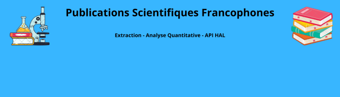

<p align="center">
  
</p>

# 📚 Projet 1 – Publications scientifiques en français


---

## 🎯 Objectif
Ce projet vise à **extraire, nettoyer, analyser et visualiser des publications scientifiques rédigées en français**, à partir de l’API HAL.  
Il combine analyse quantitative (Python, Power BI) et qualitative (NVivo).

---

## 🧰 Technologies utilisées
- Python 3.10
- Requests
- Pandas
- Matplotlib
- API HAL
- Power BI
- NVivo
- Git, GitHub
- Ubuntu Linux

---

## 📂 Structure du projet

```
Projet1_Publications_Francophones/
├── data/                   # Données brutes et nettoyées
├── docs/                   # README, rapport, synthèses
│   └── banner.png
├── nvivo_txt/              # Fichiers .txt pour NVivo
├── outputs/                # Graphiques générés
│   ├── publications_par_annee.png
│   └── publications_par_source.png
├── scripts/                # Scripts Python
│   ├── extract.py
│   ├── clean.py
│   ├── analyze.py
│   ├── main.py
│   └── nvivo_export.py
├── requirements.txt        # Liste des dépendances
└── README.md               # Documentation du projet
```

---

## 🧪 Pipeline de traitement automatisé

| Étape | Description |
|:-----|:-------------|
| 🔹 `extract.py` | Récupération des publications via l’API HAL |
| 🔹 `clean.py` | Nettoyage (doublons, formats) |
| 🔹 `analyze.py` | Création de graphes |
| 🔹 `nvivo_export.py` | Génération des fichiers `.txt` pour NVivo |
| 🔹 `main.py` | Pipeline complet automatisé |

---

## 📊 Résultats obtenus

- 📄 `data/publications_clean.csv` : données nettoyées prêtes pour analyse
- 📈 `outputs/publications_par_annee.png` : graphique des publications par année
- 📈 `outputs/publications_par_source.png` : graphique des publications par source
- 🧠 `nvivo_txt/*.txt` : fichiers textes pour codage dans NVivo

---

## ⚙️ Lancer le projet

### 1. Cloner le dépôt
```bash
git clone git@github.com:Hicham-Errihani/Projet1_Publications_FR.git
cd Projet1_Publications_FR
```

### 2. Configuration de l'environnement
```bash
# Créer un environnement virtuel (recommandé)
python -m venv venv
source venv/bin/activate  # Linux/Mac
# OU
venv\Scripts\activate    # Windows
```

### 3. Installer les dépendances
```bash
pip install -r requirements.txt
```

### 4. Exécuter le projet
```bash
python scripts/main.py
```

### 5. Vérification
Après exécution, votre terminal devrait afficher :
```
hicham@hicham-virtual-machine:~/stage_aifs/projets/01. Le nombre de publications scientifiques en français$
```

> **Notes importantes** :
> - Vérifiez que Python 3.8+ est installé (`python --version`)
> - Le chemin affiché peut varier selon votre configuration
> - Pour Windows, utilisez `python` au lieu de `python3`
> - En cas d'erreur, vérifiez les fichiers dans `scripts/`
