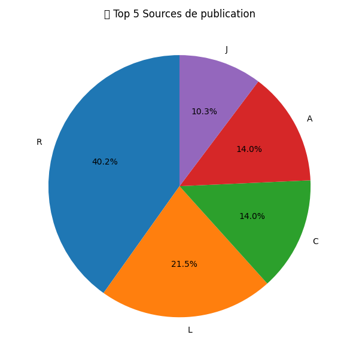

# 📚 Projet 1 – Publications scientifiques en français


---

## 🎯 Objectif
Ce projet vise à **extraire, nettoyer, analyser et visualiser des publications scientifiques rédigées en français**, à partir de l’API HAL.  
Il combine analyse quantitative (Python, Power BI) et qualitative (NVivo).

---

## 🧰 Technologies utilisées
- Python 3.10
- Requests
- Pandas
- Matplotlib
- API HAL
- Power BI
- NVivo
- Git, GitHub
- Ubuntu Linux

---

## 📁 Structure du projet

Projet1_Publications_FR/ ├── data/ # Données brutes et nettoyées ├── docs/ # README, rapport, synthèses ├── nvivo_txt/ # Fichiers .txt pour NVivo ├── outputs/ # Graphiques générés ├── scripts/ # Scripts Python │ ├── extract.py │ ├── clean.py │ ├── analyze.py │ ├── main.py │ └── nvivo_export.py ├── requirements.txt # Liste des dépendances └── README.md # Documentation du projet

---

## 🧪 Pipeline de traitement automatisé

| Étape | Description |
|:-----|:-------------|
| 🔹 `extract.py` | Récupération des publications via l’API HAL |
| 🔹 `clean.py` | Nettoyage (doublons, formats) |
| 🔹 `analyze.py` | Création de graphes |
| 🔹 `nvivo_export.py` | Génération des fichiers `.txt` pour NVivo |
| 🔹 `main.py` | Pipeline complet automatisé |

---

## 📊 Résultats obtenus

- 📄 `data/publications_clean.csv` : données nettoyées prêtes pour analyse
- 📈 `outputs/publications_par_annee.png` : graphique des publications par année
- 📈 `outputs/publications_par_source.png` : graphique des publications par source
- 🧠 `nvivo_txt/*.txt` : fichiers textes pour codage dans NVivo

---

## ⚙️ Lancer le projet

### 1. Cloner le projet
```bash
git clone git@github.com:Hicham-Errihani/Projet1_Publications_FR.git
cd Projet1_Publications_FR

---

## 📊 Visualisation des résultats

### Nombre de publications par année


### Nombre de publications par source

